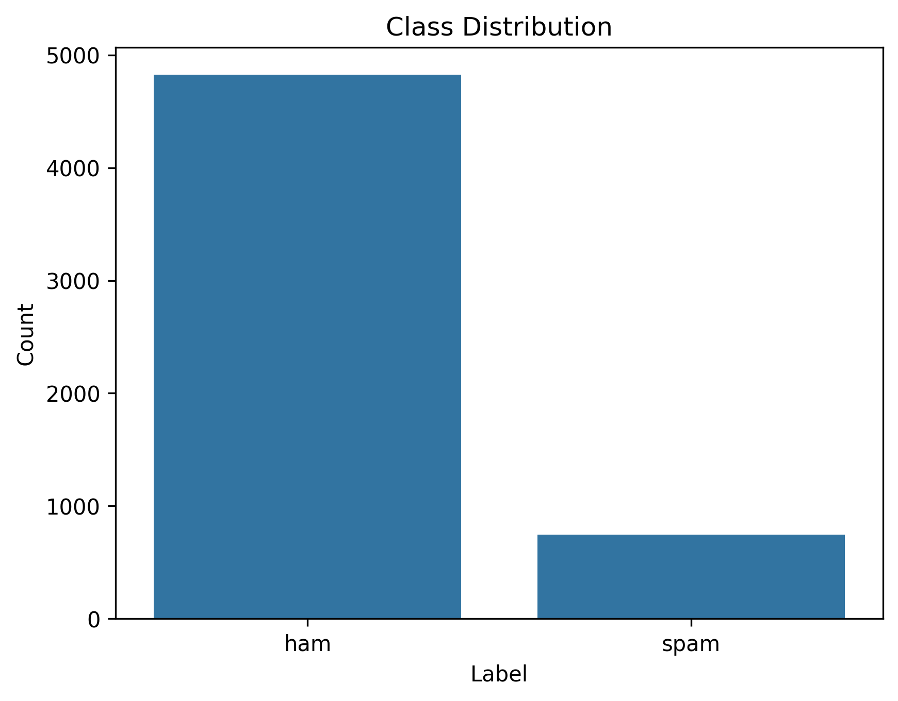
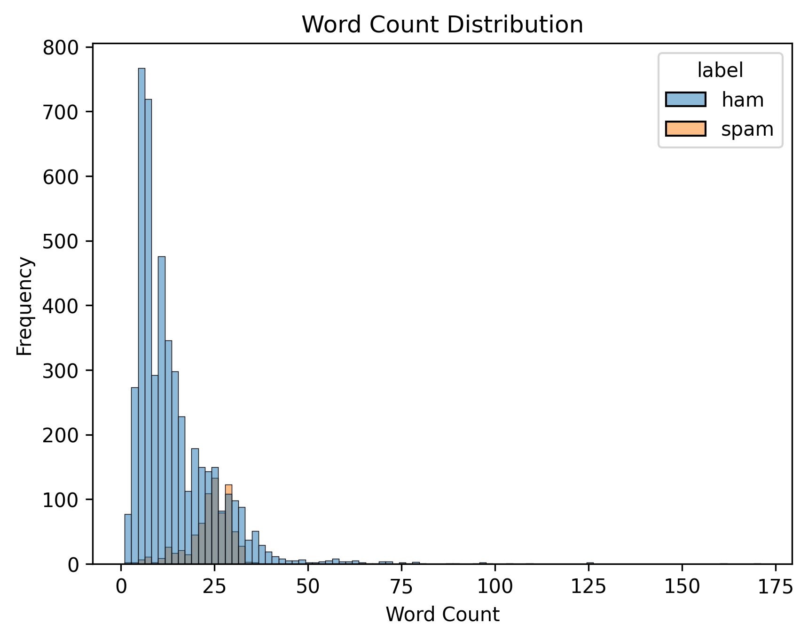
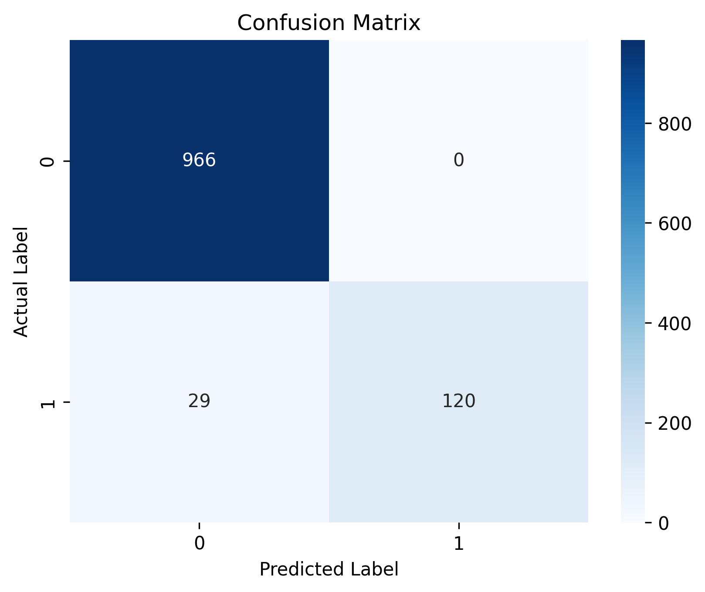

# SMS Spam Detection using NLP and Machine Learning

## Project Overview

This project builds an end-to-end **SMS Spam Detection system** using Natural Language Processing (NLP) and Machine Learning.

The objective is to automatically classify SMS messages into two categories:

* **Ham** — legitimate message
* **Spam** — unwanted or potentially harmful message

The project demonstrates a complete machine learning workflow, from data exploration and text preprocessing to model training, evaluation, error analysis, and inference.

### Main Components

* Exploratory Data Analysis (EDA)
* Text preprocessing
* TF-IDF feature engineering
* Multinomial Naive Bayes classification
* Logistic Regression comparison
* Model evaluation
* Confusion matrix analysis
* Error analysis
* Model saving
* Spam prediction pipeline

---

## Problem Statement

Spam messages are common in mobile communication and may contain advertisements, scams, phishing attempts, fraudulent offers, or unwanted promotions.

The goal of this project is to build a machine learning model that can automatically distinguish between legitimate SMS messages and spam messages.

This is a **binary classification problem**:

| Label | Meaning |
| ----- | ------- |
| `0`   | Ham     |
| `1`   | Spam    |

The model aims to correctly identify spam while minimizing false positives, where legitimate messages are incorrectly classified as spam.

---

## Dataset

### UCI SMS Spam Collection Dataset

The project uses the **SMS Spam Collection Dataset**, which contains **5,572 SMS messages**.

| Class     |     Count | Percentage |
| --------- | --------: | ---------: |
| Ham       |     4,825 |      86.6% |
| Spam      |       747 |      13.4% |
| **Total** | **5,572** |   **100%** |

Dataset source:

https://archive.ics.uci.edu/ml/datasets/sms+spam+collection

The dataset is imbalanced because legitimate messages significantly outnumber spam messages. Therefore, evaluation metrics such as **Precision, Recall, and F1-score** are important in addition to accuracy.

---

# Exploratory Data Analysis

## Dataset Shape

```text
(5572, 2)
```

The dataset contains 5,572 rows and two main columns: the message text and its corresponding label.

## Class Distribution

The dataset contains significantly more legitimate messages than spam messages.



### Class Distribution

* **Ham:** 4,825 messages
* **Spam:** 747 messages
* **Ham percentage:** 86.6%
* **Spam percentage:** 13.4%

---

## Text Statistics

The average SMS characteristics are:

| Metric             | Value |
| ------------------ | ----: |
| Average Characters | 80.49 |
| Average Words      | 15.60 |

### Statistics by Class

| Label | Average Characters | Average Words |
| ----- | -----------------: | ------------: |
| Ham   |              71.48 |         14.31 |
| Spam  |             138.67 |         23.91 |

The dataset shows that spam messages are generally longer than ham messages on average.

## Word Count Distribution



The histogram shows the distribution of word counts for ham and spam messages.

---

# Text Preprocessing

The following preprocessing steps were applied to the SMS messages:

1. Convert text to lowercase
2. Remove punctuation and special characters
3. Tokenize the text
4. Remove stopwords
5. Reconstruct the cleaned text

### Example

**Original message:**

```text
FREE Entry Into Competition!!!
```

**Processed message:**

```text
free entry competition
```

The purpose of preprocessing is to reduce unnecessary variation in the text and prepare the messages for feature extraction.

---

# Feature Engineering

## TF-IDF Vectorization

TF-IDF (**Term Frequency-Inverse Document Frequency**) was used to convert text messages into numerical feature vectors that machine learning models can process.

The vectorizer was configured as follows:

```python
TfidfVectorizer(
    max_features=3000,
    ngram_range=(1, 2),
    min_df=2
)
```

### Configuration

* **Unigrams:** Individual words
* **Bigrams:** Two-word combinations
* **Maximum features:** 3,000
* **Minimum document frequency:** 2

The TF-IDF vectorizer was fitted only on the training data to prevent **data leakage**.

---

# Machine Learning Models

Two classification algorithms were evaluated.

## 1. Multinomial Naive Bayes

Multinomial Naive Bayes was selected as the primary baseline model because it is widely used for text classification and works well with TF-IDF features.

## 2. Logistic Regression

Logistic Regression was used as a comparison model to evaluate whether another classical classification algorithm could provide better results.

---

# Model Results

## Multinomial Naive Bayes

| Metric         | Score |
| -------------- | ----: |
| Accuracy       |   97% |
| Spam Precision |  1.00 |
| Spam Recall    |  0.81 |
| Spam F1-score  |  0.89 |

## Logistic Regression

| Metric         | Score |
| -------------- | ----: |
| Accuracy       |   97% |
| Spam Precision |  1.00 |
| Spam Recall    |  0.78 |
| Spam F1-score  |  0.88 |

Based on the evaluation results, Multinomial Naive Bayes achieved a slightly higher spam recall and F1-score in this experiment, so it was selected as the final model.

---

# Confusion Matrix

The confusion matrix below shows the performance of the Multinomial Naive Bayes model on the test set.



### Confusion Matrix Results

|                 | Predicted Ham | Predicted Spam |
| --------------- | ------------: | -------------: |
| **Actual Ham**  |           966 |              0 |
| **Actual Spam** |            29 |            120 |

The model correctly classified 966 ham messages and 120 spam messages.

It incorrectly classified 29 spam messages as ham, resulting in false negatives.

---

# Error Analysis

Error analysis was performed to understand the types of spam messages that the model had difficulty identifying.

Examples of challenging messages included:

* Dating-service spam
* Conversational spam
* Subscription advertisements
* Very short spam messages

### Example False Negative

```text
talk sexy make new friends fall love worlds discreet text dating service
```

This message was difficult for the model because it did not contain some of the common spam-related keywords found in other messages.

For example:

* `free`
* `cash`
* `winner`
* `prize`

This demonstrates that keyword-based detection alone may not be sufficient for identifying all types of spam.

---

# Model Inference

After training, the model can be used to classify new SMS messages.

### Example 1

```python
predict_spam("Claim your free cash prize now.")
```

Output:

```text
SPAM (97.61%)
```

### Example 2

```python
predict_spam("Are we meeting at 7 PM today?")
```

Output:

```text
HAM (97.91%)
```

The inference pipeline uses the trained TF-IDF vectorizer and machine learning model to transform and classify new messages.

---

# Project Structure

```text
sms-spam-detector/
│
├── data/
│   └── spam.csv
│
├── notebooks/
│   └── SMS_Spam_Detection.ipynb
│
├── models/
│   ├── spam_model.pkl
│   └── tfidf_vectorizer.pkl
│
├── images/
│   ├── class_distribution.png
│   ├── word_count_distribution.png
│   └── confusion_matrix.png
│
├── src/
│   └── predict.py
│
├── requirements.txt
│
└── README.md
```

---

# Installation

Clone the repository:

```bash
git clone https://github.com/YOUR-USERNAME/sms-spam-detector.git
```

Move into the project directory:

```bash
cd sms-spam-detector
```

Install the required Python packages:

```bash
pip install -r requirements.txt
```

---

# Requirements

The main libraries used in this project are:

```text
pandas
numpy
scikit-learn
nltk
matplotlib
seaborn
joblib
```

---

# How to Run

## 1. Open the Notebook

Open:

```text
notebooks/SMS_Spam_Detection.ipynb
```

You can run the notebook using:

* Google Colab
* Jupyter Notebook
* JupyterLab

## 2. Train the Model

Run the notebook cells to:

1. Load the dataset
2. Explore the data
3. Preprocess the messages
4. Split the dataset
5. Create TF-IDF features
6. Train the models
7. Evaluate the models
8. Save the trained model and vectorizer

## 3. Make Predictions

The saved model can then be used to classify new SMS messages.

---

# Visualizations

This project includes three main visualizations.

### 1. Class Distribution

Shows the number of ham and spam messages.

```text
images/class_distribution.png
```

### 2. Word Count Distribution

Shows the distribution of message word counts by class.

```text
images/word_count_distribution.png
```

### 3. Confusion Matrix

Shows the correct and incorrect predictions made by the final model.

```text
images/confusion_matrix.png
```

---

# Future Improvements

Possible improvements for this project include:

* Hyperparameter tuning
* Testing different TF-IDF configurations
* Adding trigram features
* Testing class weighting
* Comparing additional machine learning algorithms
* Testing Random Forest and XGBoost
* Experimenting with transformer models such as BERT or DistilBERT
* Building a Flask or FastAPI API
* Creating a Streamlit web application
* Deploying the spam detection system as an online service

---

# Skills Demonstrated

This project demonstrates practical experience with:

* Python
* Pandas
* NumPy
* Natural Language Processing
* Text preprocessing
* TF-IDF feature engineering
* Multinomial Naive Bayes
* Logistic Regression
* Binary classification
* Train/test splitting
* Model evaluation
* Precision, Recall, and F1-score
* Confusion matrix analysis
* Exploratory Data Analysis
* Error analysis
* Model serialization with Joblib
* Machine learning inference

---

# Key Learning Outcomes

Through this project, I practiced the complete machine learning workflow:

```text
Raw Data
   ↓
Data Exploration
   ↓
Text Preprocessing
   ↓
Train/Test Split
   ↓
TF-IDF Feature Engineering
   ↓
Model Training
   ↓
Model Evaluation
   ↓
Error Analysis
   ↓
Model Saving
   ↓
New Message Prediction
```

This project helped demonstrate how classical NLP and machine learning techniques can be combined to solve a real-world text classification problem.

---

# Author

**Miruk Yilikal**

Electrical & Computer Engineering Student
Addis Ababa University

**Interests:** Machine Learning | Artificial Intelligence | Data Science
